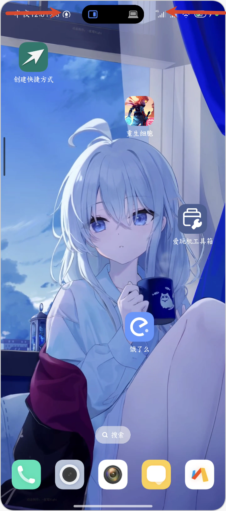
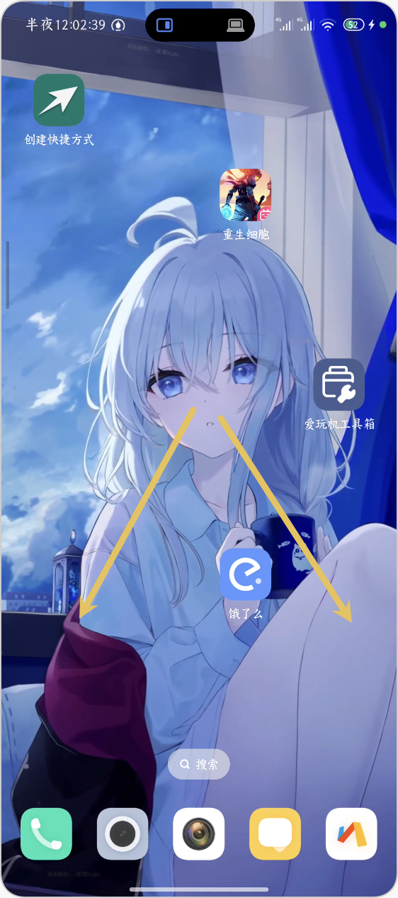
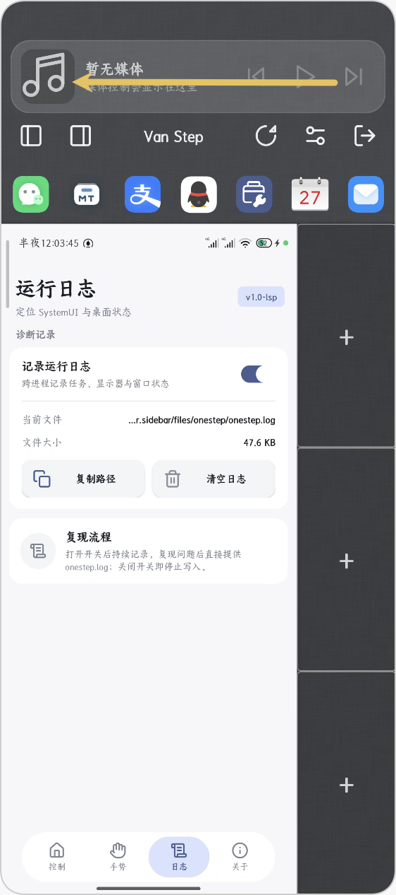
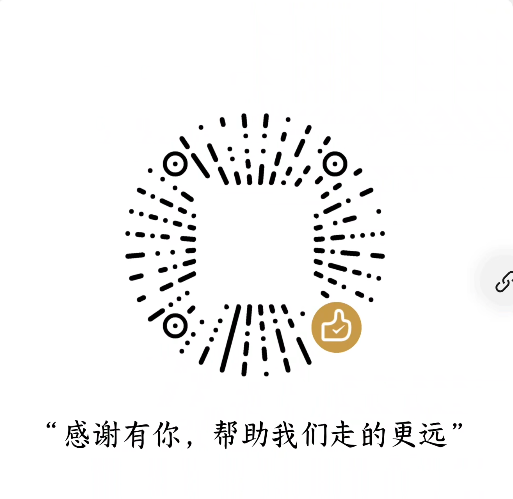

# Van Step

> 将 SmartisanOS 的 **One Step** 侧边栏和 **BigBang** 文字拆分功能，以 LSPosed 模块的形式带入 HyperOS。

[](#环境要求)
[](#环境要求)
[](https://github.com/LSPosed/LSPosed)
[](LICENSE)

Smartisan OS 已经远去，但它最好的两个创意不应被遗忘。Van Step 在现代小米 HyperOS 之上还原了 One Step 侧边栏——将任何内容拖拽到任何地方——以及 BigBang——点按文字，即刻拆词。它通过 Hook SystemUI 和系统启动器来实现.

## 功能

### 侧边栏

从屏幕边缘滑入，即可查看最近的图片、文件和剪贴板历史。将条目拖拽到应用图标上即可分享，或拖拽到窗口槽位即可在其中打开。

- **最近图片 / 文件 / 剪贴板**，各自记住上次滚动位置
- **拖拽分享**至应用快捷方式，每次命中时提供触觉反馈
- **媒体控制**位于顶部栏，重新打开时定位到你上次使用的页面
- **任务切换**和自由窗口控制，包括主/副分屏互换

### BigBang

将任意文本炸裂为可点按的词语碎片，忠实还原原版体验：碎片先收缩至你的触摸点，然后向外迸发就位。

- 中英文混合分词，标点符号作为独立的窄碎片呈现
- 跨碎片拖拽进行范围选择；长按可拖出选区
- 复制、分享，或将选区直接拖入其他应用
- 以悬浮面板形式覆盖在变暗的宿主应用之上，而非全屏页面

### 手势触发方式

| 触发方式 | 工作原理 |
| --- | --- |
| 大面积按压 | 读取厂商触控 HAL 的接触密度信号——参见 [触控守护进程](#触控守护进程) |
| 双指长按 | 纯 `MotionEvent` 几何计算 |
| 长按回退 | 可选方案，用于面积信号不可用时 |
| 角落 / 边缘滑动 | 可从屏幕边缘自定义入口 |

模块设置中提供按应用黑名单和可调节的长按时长。

## 环境要求

- Android 15 – 16（`minSdk 35`，`targetSdk 36`）
- HyperOS  2.0 / 3.0（已在小米 15 Pro、 和 K40 上测试）
- 搭载 Zygisk 的 [LSPosed](https://github.com/LSPosed/LSPosed)
- Root 权限（Magisk / KernelSU / APatch）——持久化设置和触控守护进程均需要
！！！在使用前请备份数据 硬盘有价 数据无价！！！
## 安装

1. 安装 APK 并在 LSPosed 中启用 **Van Step**。
2. 启用以下作用域，然后**重启**：

   | 作用域 | 用途 |
   | --- | --- |
   | `系统框架`（`android`、`system`） | 窗口管理、重启策略、手势 Hook |
   | `系统界面`（`com.android.systemui`） | 侧边栏本体 |
   | `启动器`（`com.miui.home`） | 从桌面触发 |

   system_server 的 Hook 仅在开机时安装，因此重启是必须的——仅重启 SystemUI 不会安装这些 Hook。

3. 在 Root 管理器中授予本应用 **Root 权限**。设置通过 `su` 写入，如果没有 Root 权限，所有开关都会静默回退。

### 触控守护进程

大面积按压触发方式需要一个小型 Root 守护进程，因为触控驱动虽然声明了 `ABS_MT_TOUCH_MAJOR`，但从未实际发出该值——接触面积信息仅存在于厂商触控 HAL 内部。`scripts/onestep-touchd.sh` 通过 uprobe 读取该信息，并将判定结果以系统属性的形式发布。
# 守护进程仅在mi15pro上测试成功，其他设备请自行测试/修改

将其安装为 Magisk/KernelSU 模块，以便每次开机自动启动：

```sh
adb push scripts/module/module.prop scripts/module/service.sh /data/local/tmp/
adb push scripts/onestep-touchd.sh scripts/onestep-touchd-stop.sh /data/local/tmp/
adb push scripts/deploy-module.sh /data/local/tmp/
adb shell su -M -c 'sh /data/local/tmp/deploy-module.sh'
```
## 构建

```sh
./gradlew assembleDebug

```

需要 JDK 21。Gradle 8.7 会拒绝 JDK 24 并报 `Unsupported class file major version 68` 错误，因此如果你的默认 JVM 是 JDK 24，请将构建指向其他版本：

```sh
JAVA_HOME="/path/to/jdk-21" ./gradlew assembleDebug

```

## 项目结构

| 路径 | 内容 |
| --- | --- |
| `src/` | 侧边栏 UI 和数据管理器，运行于 SystemUI 内部 |
| `src-lsp/` | Xposed Hook、BigBang、窗口和手势控制 |
| `src-stubs/` | AOSP 中不存在的 SmartisanOS 框架类的桩代码 |
| `scripts/` | 触控守护进程及其 Root 模块打包脚本 |
| `res/` | 布局、绘图资源和字符串 |

## 致谢

**Smartisan Technology（锤子科技）**——感谢 One Step 和 BigBang，以及将它们开源。本项目是 [SmartisanTech/packages_apps_OneStep](https://github.com/SmartisanTech/packages_apps_OneStep) 的移植版本，以 Apache License 2.0 发布。这里每一个值得称道的交互都是他们的原创；本仓库所做的工作，主要是让这些创意在别人的 ROM 上跑起来。

**BigBang 团队**，其原版 `com.smartisanos.textboom` 构建提供了精确的动画时序、碎片颜色和窗口参数。

**[LSPosed](https://github.com/LSPosed/LSPosed)** 和 [libxposed](https://github.com/libxposed/api) 的作者们，感谢这个框架让 Hook SystemUI 和 system_server 成为可能，而无需触碰 ROM。

**[Lucide](https://lucide.dev)** 提供的图标集。完整声明见 [THIRD_PARTY_NOTICES.md](THIRD_PARTY_NOTICES.md)。

**[SukiSU-Ultra](https://github.com/SukiSU-Ultra/SukiSU-Ultra)**，其 Miuix 风格的管理界面是本模块设置页面的参考——悬浮胶囊底部栏、色调卡片和状态标签均是其 Compose 组件的 View 层移植。其液态玻璃效果则基于 [Kyant0/AndroidLiquidGlass](https://github.com/Kyant0/AndroidLiquidGlass)。


### 遇到问题
1. **模块未启用**：检查 LSPosed 是否已启用本模块，并确保其作用域已启用。
2. **权限不足**：检查 Root 管理器是否已授予本应用 **Root 权限**。
3. **触控守护进程未启动**：检查守护进程是否已安装并启动。如果未启动，请参考 [触控守护进程](#触控守护进程)。
4. **系统版本不兼容**：本模块仅支持 Android 15 – 16，请确保您的设备运行的是兼容的 Android 版本。
5. 自行无法解决的问题 请提交issue至[https://github.com/LAOBILAXI233/onestep_on_hyper](https://github.com/LAOBILAXI233/onestep_on_hyper)
   提交的issus应该包括但不限于:
   1. 系统版本
   2. HyperOS版本
   3. LSPosed版本
   4. 出现问题的具体操作
   5. 出现问题的具体描述
   6. 出现问题的具体截图
   7. 出现问题的具体日志
   日志的获取方式:/data/data/com.hyper.sidebar/files/onestep/onestep.log
### 手势操作
1. **onestep启动**：从状态栏边缘向内滑动，即可打开侧边栏，如果安装守护进程即可触发大面积按压，大面积按压并向斜方向滑动。在侧边栏中，你可以查看最近的图片、文件和剪贴板历史，并将条目拖拽到应用图标上即可分享，或拖拽到窗口槽位即可在其中打开。
2. **BigBang**：在应用中大面积按压（以安装守护进程模块）或双指长按，即可打开 BigBang。在 BigBang 中，你可以将任意文本炸裂为可点按的词语碎片，并将选区拖拽到其他应用中。
3. **媒体控制**：在侧边栏的顶部栏，你可以找到媒体控制按钮，包括播放、暂停、上一首、下一首等操作。
4.媒体控制与近期图片、文件、剪贴板历史切换 向左滑动解锁三大金刚键（bushi）

## 贡献
我的前端和动画很烂，如果你有更好的想法，欢迎提交 Pull Request 或 Issue。
欢迎提交 Pull Request 或 Issue。

# 可以给我点个star吗？:)

## Buy me a coffee
如果你觉得这个项目对你有帮助，欢迎请我喝杯咖啡。


   ## 许可证

Apache License 2.0——详见 [LICENSE](LICENSE)。
